# 🤖 DeliveryBot — Bot de Pedidos para Cafetería en Telegram

> **Proyecto académico** | Ingeniería de Sistemas | CampusLands  
> **Estudiante:** Camilo García  
> **Herramientas:** n8n · Telegram Bot API · Google Sheets · ngrok

---

## 📋 Descripción

**DeliveryBot** es un bot de Telegram que automatiza el proceso de pedidos de una cafetería universitaria. Permite a los clientes consultar el menú, agregar productos al carrito, visualizar su pedido y confirmarlo, todo desde Telegram sin intervención humana.

El sistema utiliza **n8n** como motor de automatización, **Google Sheets** como base de datos, y **ngrok** para exponer el webhook al internet.

---

## 🛠️ Stack Tecnológico

| Tecnología | Uso |
|---|---|
| n8n v2.22.5 | Motor de automatización y flujos |
| Telegram Bot API | Interfaz del bot con el usuario |
| Google Sheets | Base de datos (MENU, SESSIONS, PEDIDOS) |
| ngrok | Tunnel para exponer webhook |
| JavaScript | Lógica de nodos Code |

---

## ⚙️ Arquitectura del Sistema

```
Usuario Telegram
      │
      ▼
Telegram Bot API
      │  webhook POST
      ▼
   ngrok tunnel
https://clubbing-stillness-register.ngrok-free.dev
      │
      ▼
  n8n (localhost:5678)
      │
      ├── Router Principal (JS) ── detecta acción
      ├── Switch Acciones ──────── enruta el flujo
      ├── Google Sheets ────────── lee/escribe datos
      └── Telegram API ─────────── responde al usuario
```

---

## 🚀 Instalación y Configuración

### 1. Iniciar ngrok

```bash
ngrok http 5678
```

### 2. Iniciar n8n (Windows CMD)

```cmd
set N8N_PORT=5678
set WEBHOOK_URL=https://clubbing-stillness-register.ngrok-free.dev
set N8N_USER_MANAGEMENT_DISABLED=true
n8n start
```

### 3. Importar workflow en n8n

`···` → **Import from file** → `DeliveryBot_v2_DEFINITIVO.json`

### 4. Publicar

Clic en **Publish** en n8n.

---

## 🖥️ Capturas del Sistema

### 1. Infraestructura

**ngrok activo — tunnel hacia localhost:5678**

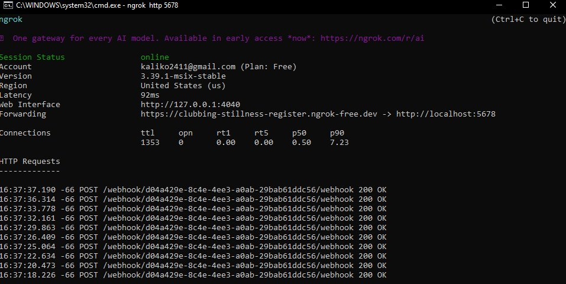

**n8n iniciado desde CMD con variables de entorno**

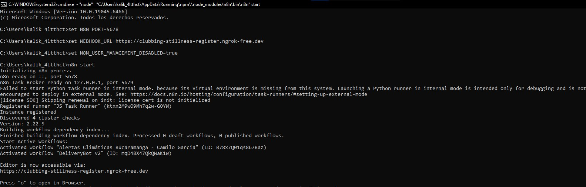

**Workflow completo en el editor de n8n**

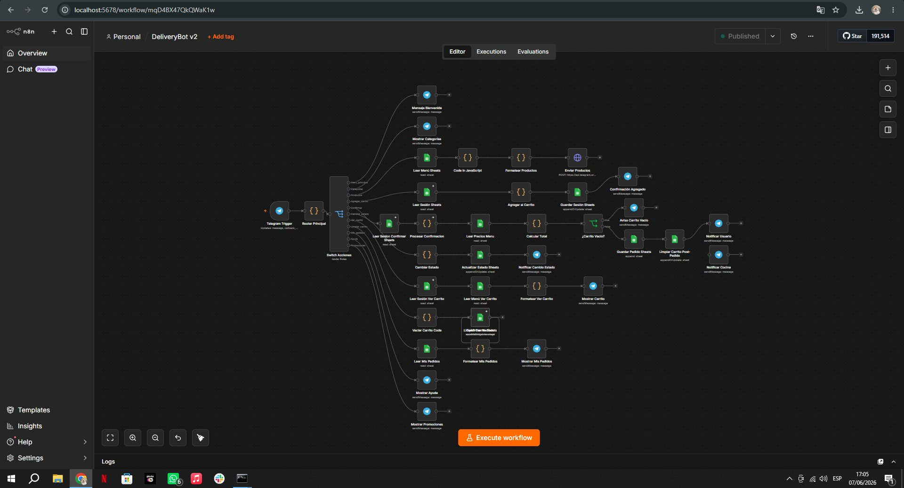

---

### 2. Nodos del Workflow

**Router Principal — detecta acción y extrae datos del callback**

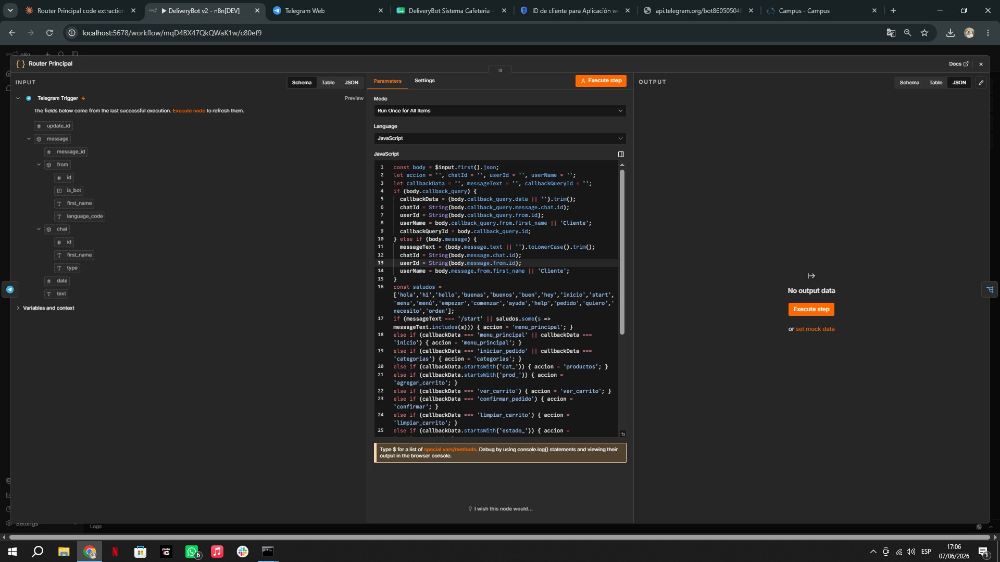

**Switch Acciones — reglas de enrutamiento (parte 1)**

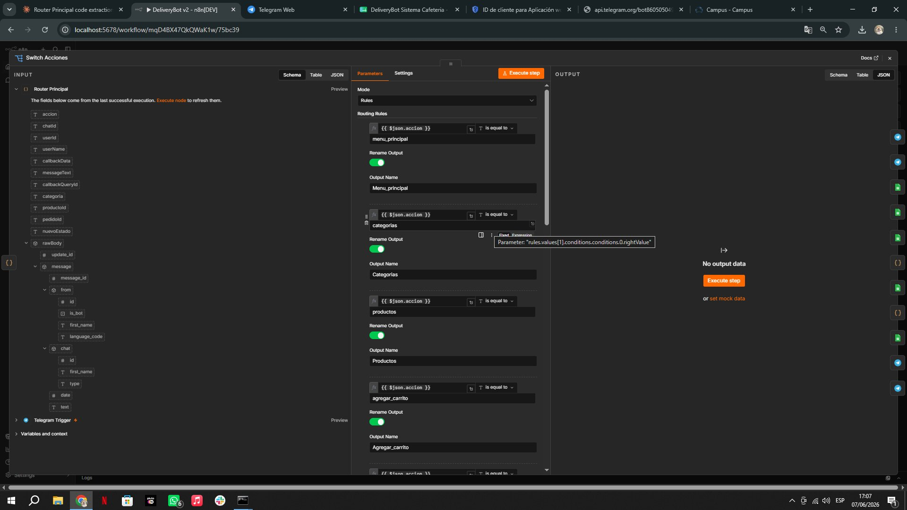

**Switch Acciones — reglas de enrutamiento (parte 2)**

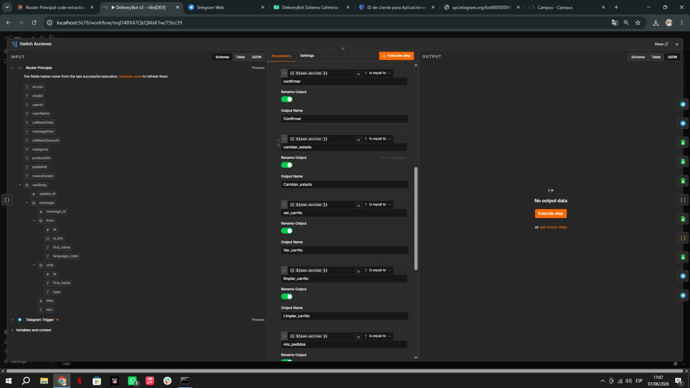

**Switch Acciones — reglas de enrutamiento (parte 3)**

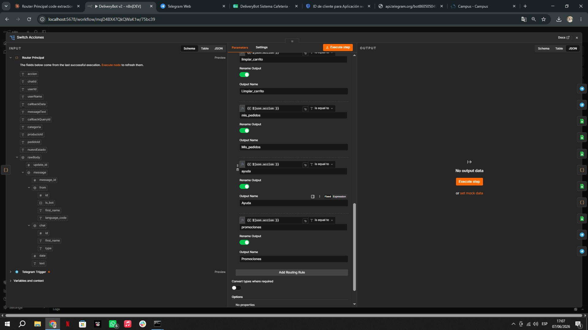

**Leer Menú Sheets — lectura de productos desde Google Sheets**

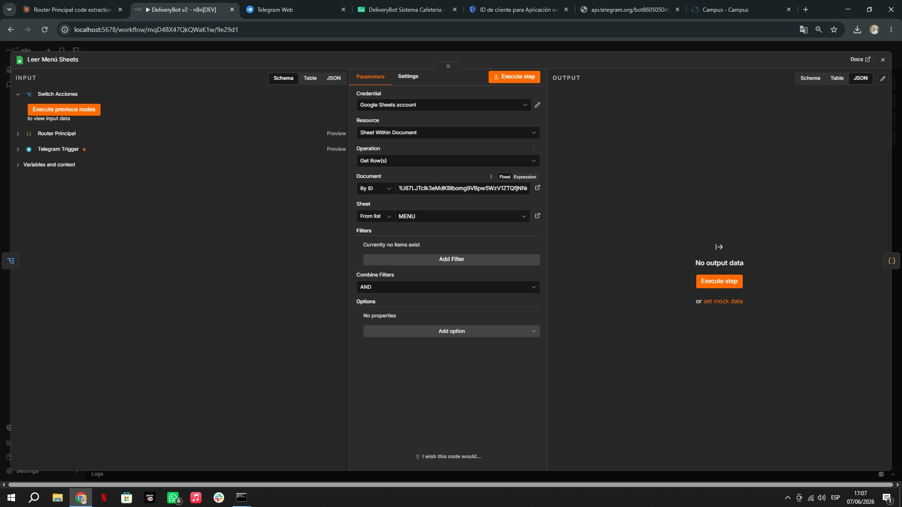

**Guardar Sesión Sheets — persistencia del carrito**

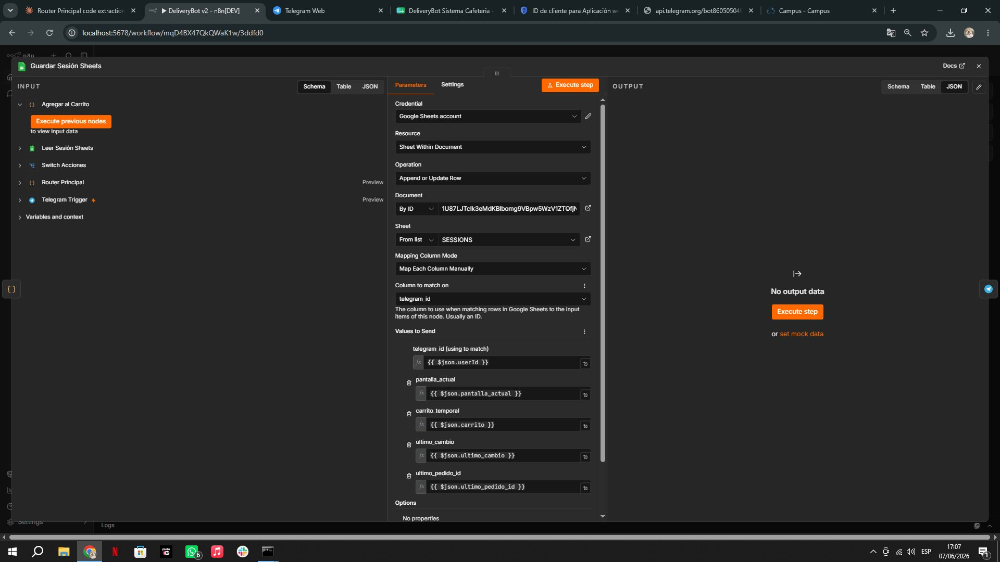

**Enviar Productos — HTTP Request directo a Telegram API**

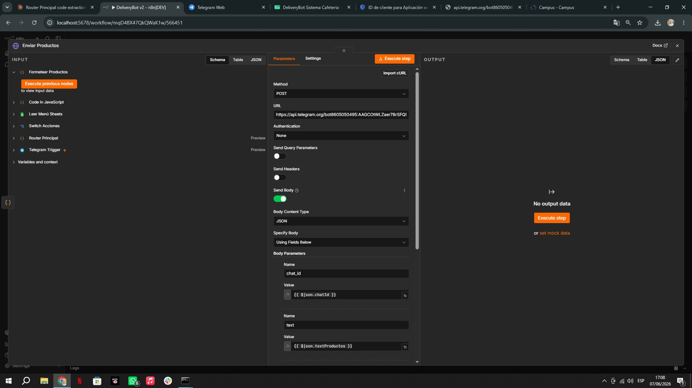

**Enviar Productos — Body con reply_markup para botones**

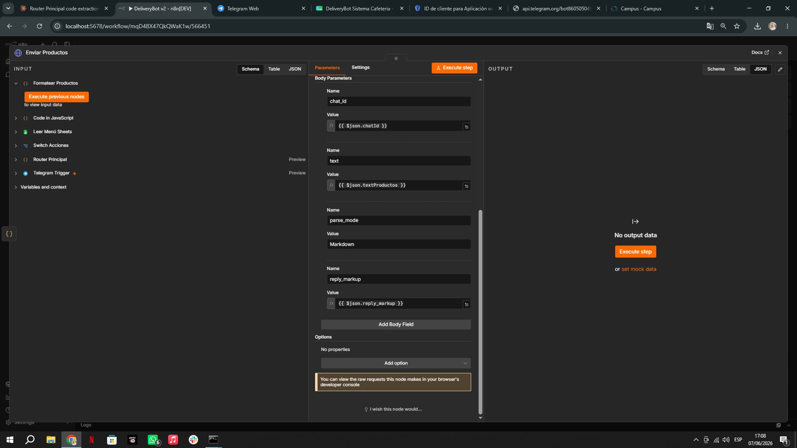

---

### 3. Google Sheets

**Hoja MENU — 12 productos en 3 categorías**

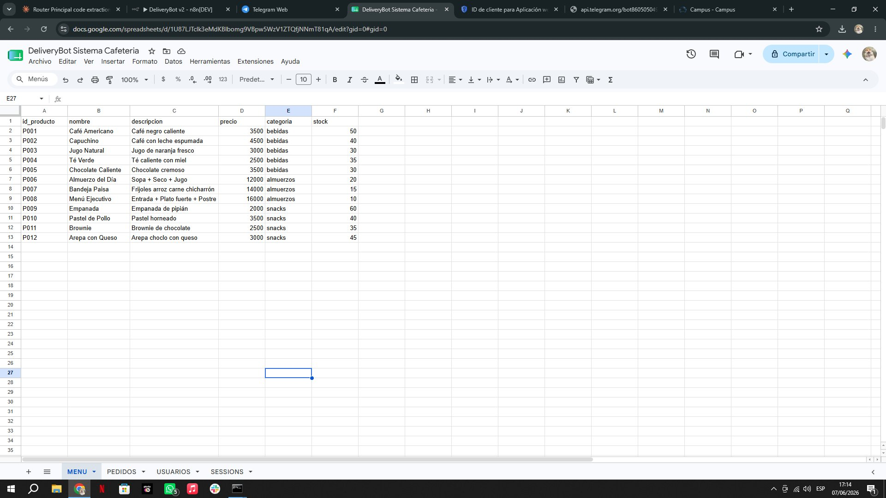

**Hoja SESSIONS — sesión activa del usuario con carrito en JSON**

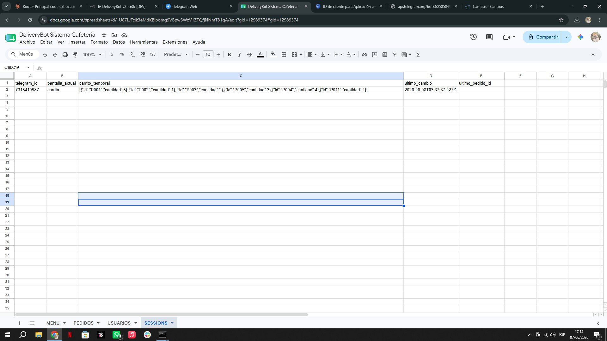

**Hoja PEDIDOS — registro de pedidos confirmados**

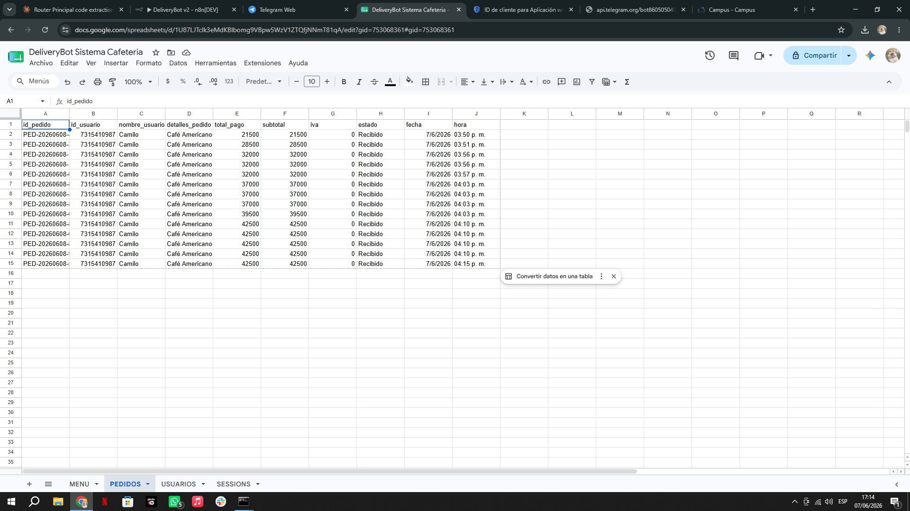

---

### 4. Bot en Telegram

**Mensaje de bienvenida con nombre del usuario y botones de acción**


**Selección de categoría — Bebidas, Almuerzos, Snacks**

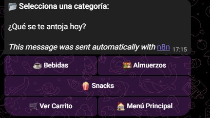

**Lista de productos numerados con precios y botones**

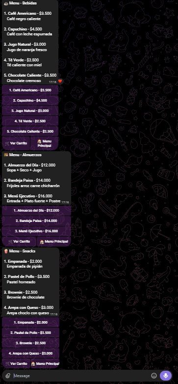

**Vista del carrito con productos, cantidades y total**

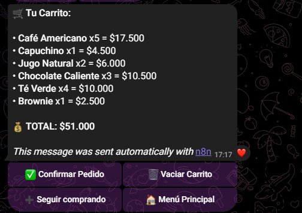

**Centro de Ayuda y Promociones del día**

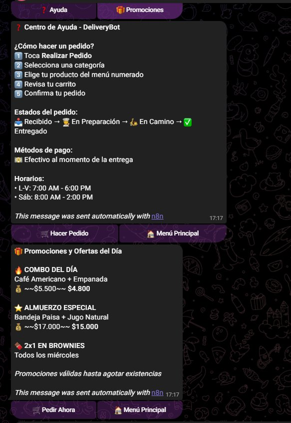

---

### 5. Executions en n8n

**Lista de ejecuciones exitosas del workflow**

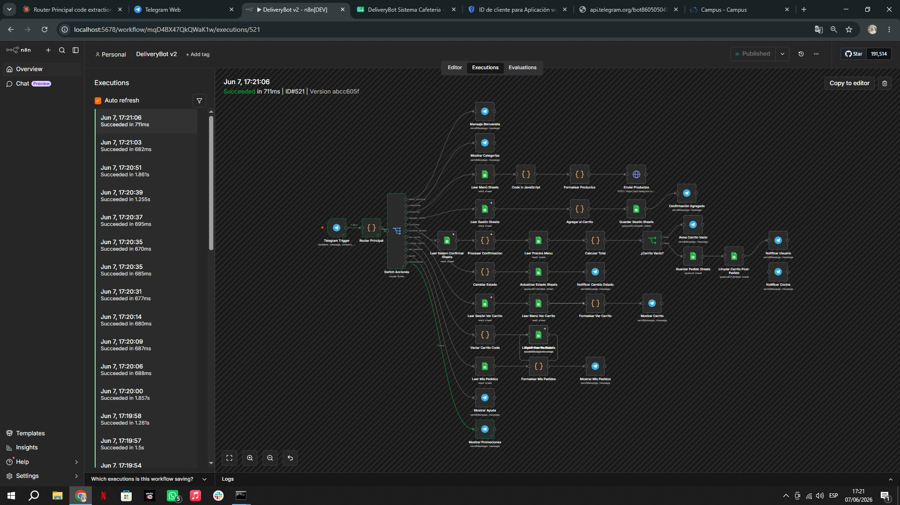

**Ejecución detallada con nodos en verde**

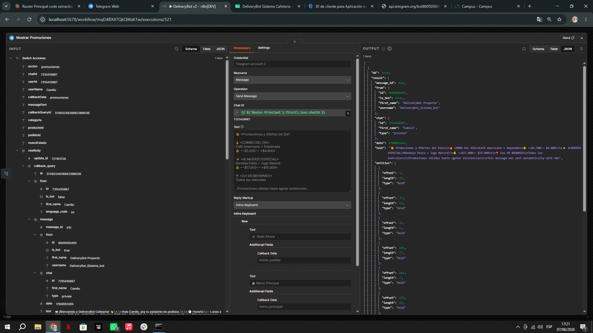

---

## 📊 Estructura de Google Sheets

### Hoja MENU
| id_producto | nombre | descripcion | precio | categoria | stock |
|---|---|---|---|---|---|
| P001 | Café Americano | Café negro caliente | 3500 | bebidas | 50 |
| P006 | Almuerzo del Día | Sopa + Seco + Jugo | 12000 | almuerzos | 20 |
| P009 | Empanada | Empanada de pipián | 2000 | snacks | 60 |

### Hoja SESSIONS
| telegram_id | pantalla_actual | carrito_temporal | ultimo_cambio | ultimo_pedido_id |
|---|---|---|---|---|
| 7315410987 | carrito | [{"id":"P001","cantidad":2}] | 2026-06-07T... | |

### Hoja PEDIDOS
| id_pedido | id_usuario | nombre_usuario | detalles_pedido | total_pago | estado | fecha | hora |
|---|---|---|---|---|---|---|---|
| PED-20260608-... | 7315410987 | Camilo | Café Americano x1 | 21500 | Recibido | 7/6/2026 | 03:50 p.m. |

---

## 📱 Funcionalidades

| Funcionalidad | Estado |
|---|---|
| Bienvenida personalizada | ✅ |
| Menú por categorías | ✅ |
| Productos numerados con botones | ✅ |
| Agregar al carrito | ✅ |
| Ver carrito con total | ✅ |
| Confirmar pedido | ✅ |
| Guardar pedido en Sheets | ✅ |
| Historial de pedidos | ✅ |
| Vaciar carrito | ✅ |
| Centro de ayuda | ✅ |
| Promociones del día | ✅ |

---

## 📁 Archivos del Repositorio

```
DeliveryBot-CampusLands/
├── README.md
├── DeliveryBot_v2_DEFINITIVO.json
└── capturas/
    ├── 01_ngrok_activo.png
    ├── 02_n8n_terminal.png
    ├── 03_workflow_completo.png
    ├── 04_router_principal.png
    ├── 05_switch_acciones_1.png
    ├── 06_switch_acciones_2.png
    ├── 07_switch_acciones_3.png
    ├── 08_leer_menu_sheets.png
    ├── 09_guardar_sesion_sheets.png
    ├── 10_enviar_productos_http.png
    ├── 11_enviar_productos_body.png
    ├── 12_sheets_menu.png
    ├── 13_sheets_sessions.png
    ├── 14_sheets_pedidos.png
    ├── 15_bot_bienvenida.png
    ├── 16_bot_categorias.png
    ├── 17_bot_productos.png
    ├── 18_bot_carrito.png
    ├── 19_bot_ayuda_promociones.png
    ├── 20_executions_lista.png
    └── 21_execution_detalle.png
```

---

## 👨‍💻 Autor

**Camilo García**  
Estudiante de Ingeniería de Sistemas  
CampusLands — 2026
